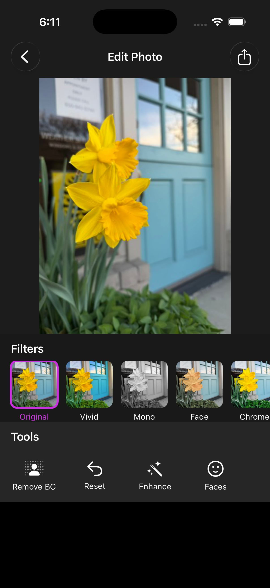
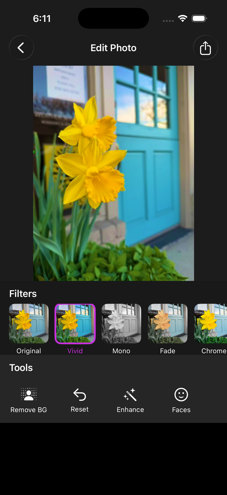
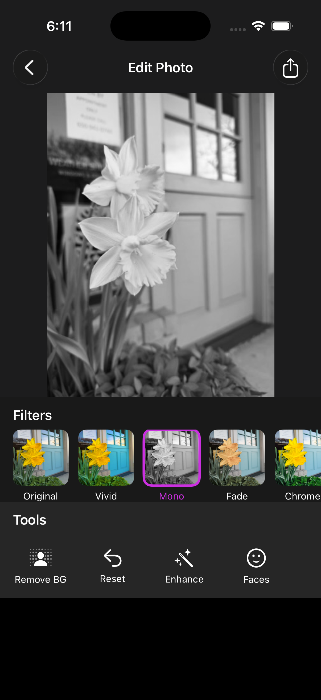
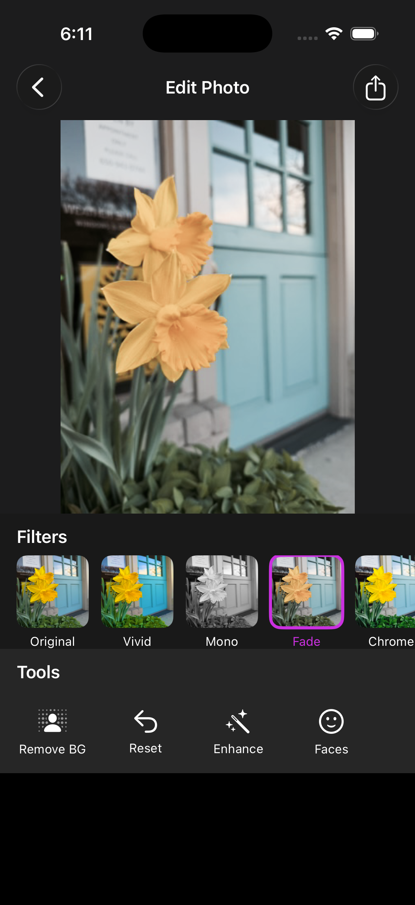
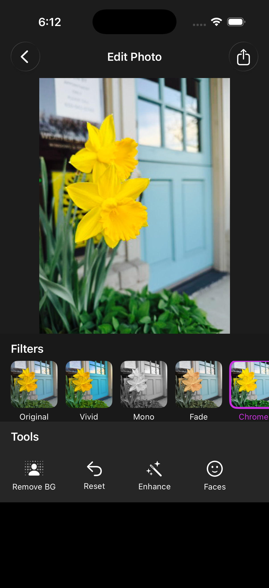

# App 01 — AI Photo Editor

An AI-powered photo editing iOS app built with SwiftUI. Edit, enhance, and transform your photos using Apple's on-device AI — no internet required.

## Screenshots

### Sample Photo

<table><tr>
  <td align="center"><b>Original Photo</b><br/></td>
  <td align="center"><b>In App (Original filter)</b><br/></td>
</tr></table>

### Filter Results (Simulator)

| Vivid | Mono | Fade | Chrome |
|:---:|:---:|:---:|:---:|
|  |  |  |  |

## Features

- **AI Background Removal** — Remove backgrounds from portrait photos using Apple's Vision framework
- **AI Auto Enhance** — Automatically adjusts exposure, contrast, saturation and white balance
- **8 Photo Filters** — Original, Vivid, Mono, Fade, Chrome, Noir, Warm, Cool
- **Face Detection** — Detects and highlights faces in photos using Vision framework
- **Photo Import** — Import photos directly from your photo library
- **Export and Share** — Save edited photos or share to other apps
- **Works Offline** — All AI processing runs on-device using iPhone's Neural Engine

## Technologies

| Technology | Purpose |
|---|---|
| SwiftUI | UI framework |
| Vision | AI person segmentation, background removal, face detection |
| Core Image | Photo filters and auto enhancement |
| Core ML | On-device machine learning |
| PhotosUI | Photo library access |

## Requirements

- iOS 17.4+
- Xcode 16+
- iPhone with Neural Engine (iPhone XS or later) for background removal

> Face detection and filters work on simulator. Background removal requires a real device.

## Getting Started

1. Clone the repository
```bash
git clone https://github.com/preeti-chauhan/app-01-ai-photo-editor.git
```
2. Open `AIPhotoEditor.xcodeproj` in Xcode
3. Select your target device
4. Press `Cmd + R` to build and run

## Changelog

### v1.1
- Fixed background removal mask scaling — mask now correctly covers the full image using independent X/Y scaling via `CGAffineTransform` (previously used a single uniform scale that cut off non-square images)
- Fixed face detection coordinate space — bounding boxes now use point coordinates consistent with SwiftUI layout, preventing misaligned overlays
- Added "No Faces Detected" alert so users get feedback instead of silence
- Reset button now clears face detection boxes

### v1.0
- Initial release with background removal, filters, auto enhance, face detection, and share

## Part of 10 Apps Series

This is App 01 of a series of 10 iOS apps built with SwiftUI.

| App | Name | Status |
|---|---|---|
| 01 | AI Photo Editor | Complete |
| 02 | Coming Soon | Planned |
| 03 | Coming Soon | Planned |
| 04 | Coming Soon | Planned |
| 05 | Coming Soon | Planned |

## License

MIT License
