# App 01 — AI Photo Editor

An AI-powered photo editing iOS app built with SwiftUI — a hands-on project to explore Vision and Core Image frameworks.

## Features

- ✅ **Photo Import** — Import photos directly from your photo library
- ✅ **8 Photo Filters** — Original, Vivid, Mono, Fade, Chrome, Noir, Warm, Cool
- ✅ **AI Auto Enhance** — Automatically adjusts exposure, contrast, saturation and white balance
- ✅ **Reset** — Restore the photo to its original state
- ✅ **Face Detection** — Detects and highlights faces in photos using Core Image
- ✅ **AI Background Removal & Replacement** — Remove the background from photos containing a person and replace it with a solid color, custom color, or a photo from your library (photo must have a person in the frame)
- ✅ **Export and Share** — Save edited photos or share to other apps

## Screenshots

### Filter Results

| Original | Vivid | Mono | Fade |
|:---:|:---:|:---:|:---:|
|  |  |  |  |

| Chrome | Noir | Warm | Cool |
|:---:|:---:|:---:|:---:|
|  | 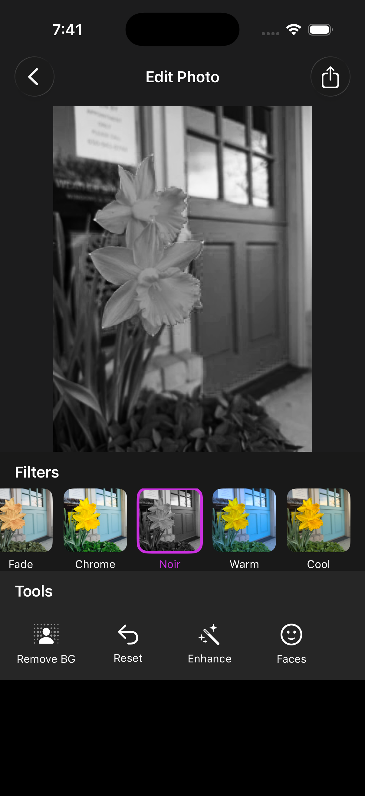 | 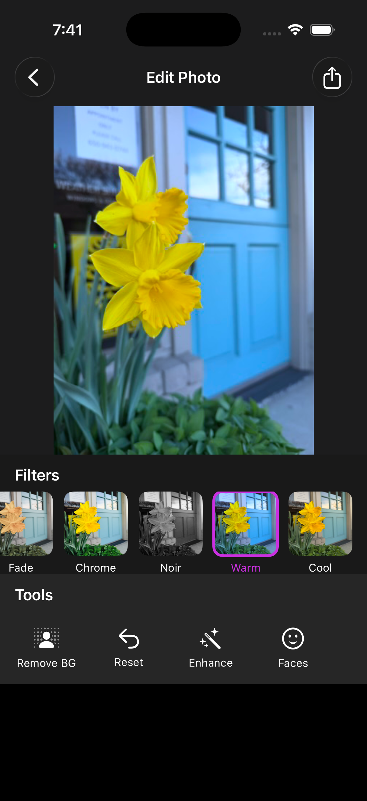 | 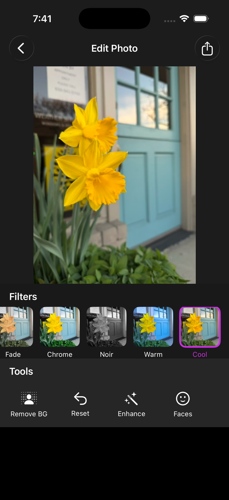 |

### Auto Enhance

<table><tr>
  <td align="center"><b>Original</b><br/></td>
  <td align="center"><b>Auto Enhanced</b><br/>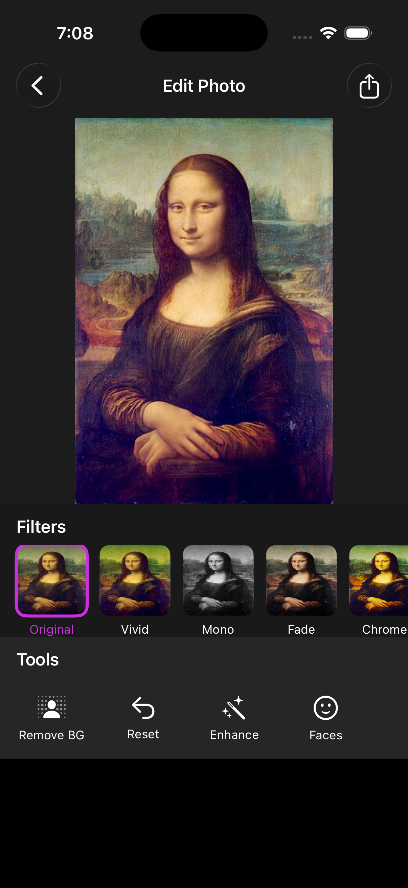</td>
  <td align="center"><b>Reset</b><br/>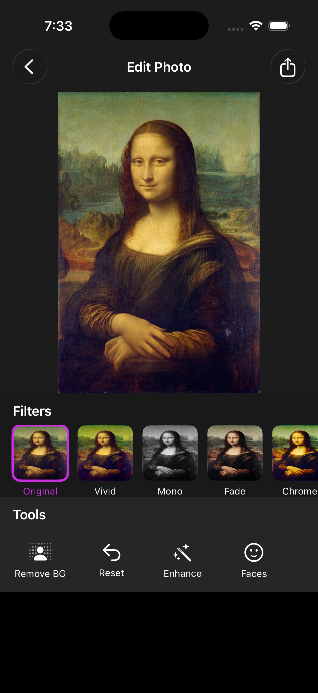</td>
</tr></table>

### Face Detection

<table><tr>
  <td align="center"><b>Single Face</b><br/>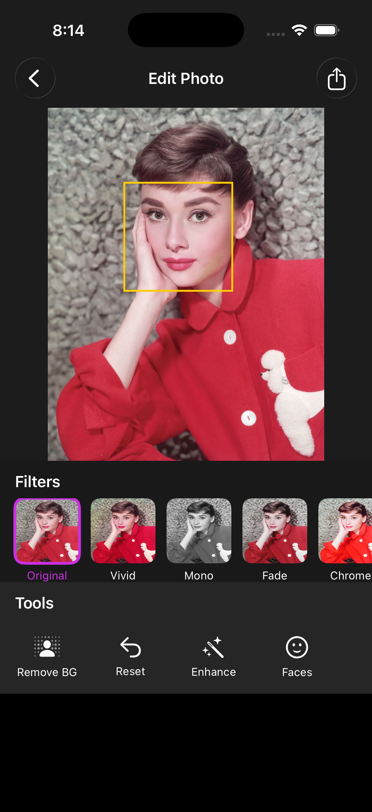</td>
  <td align="center"><b>Reset</b><br/>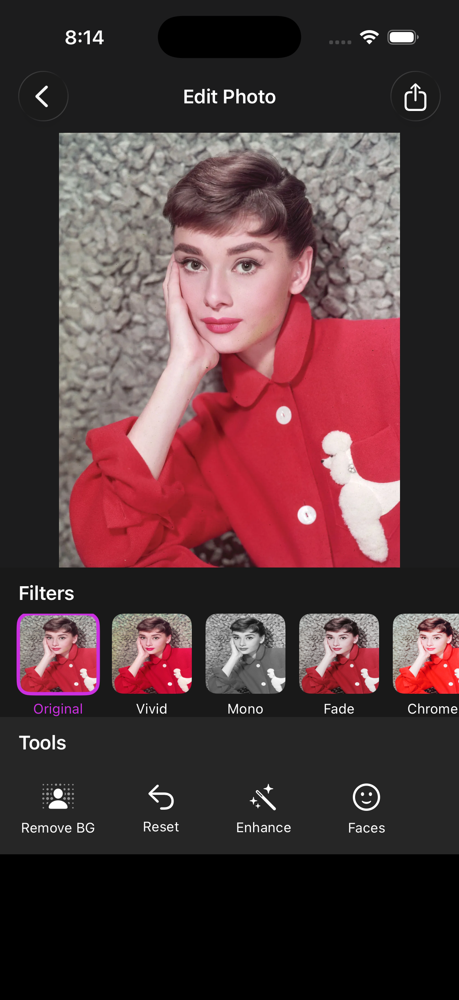</td>
  <td align="center"><b>Multiple Faces</b><br/>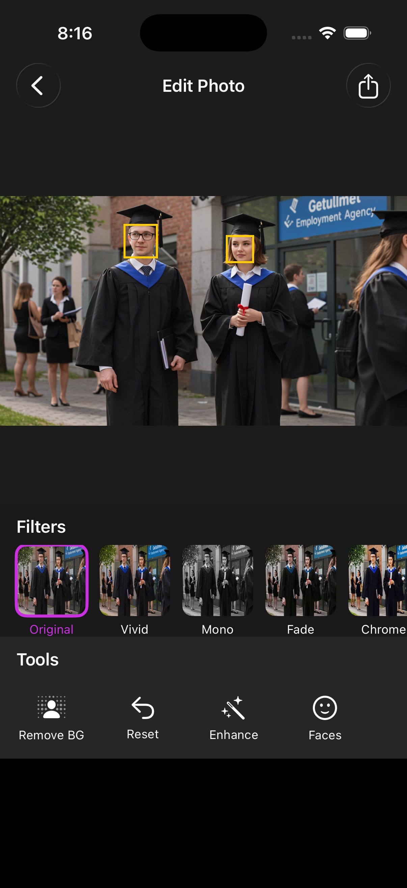</td>
</tr></table>

### Background Removal & Replacement

<table><tr>
  <td align="center"><b>Original</b><br/>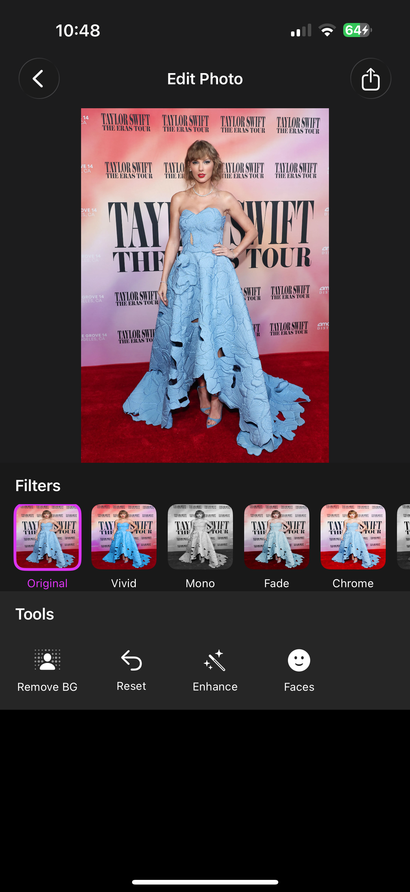</td>
  <td align="center"><b>Transparent</b><br/>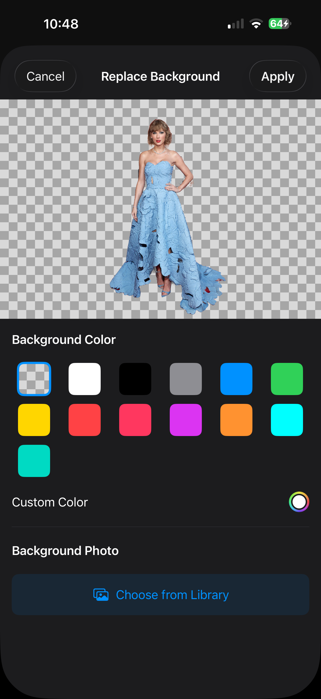</td>
  <td align="center"><b>Color Background</b><br/>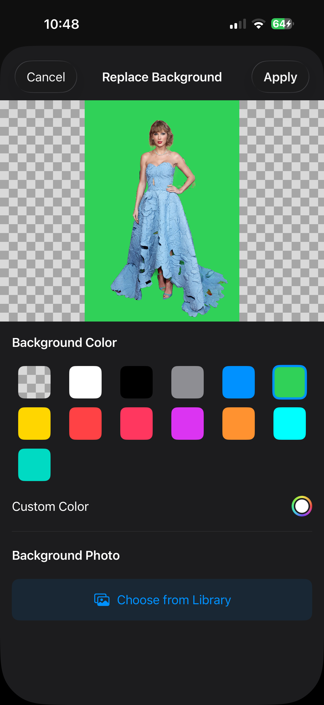</td>
  <td align="center"><b>Photo Background</b><br/>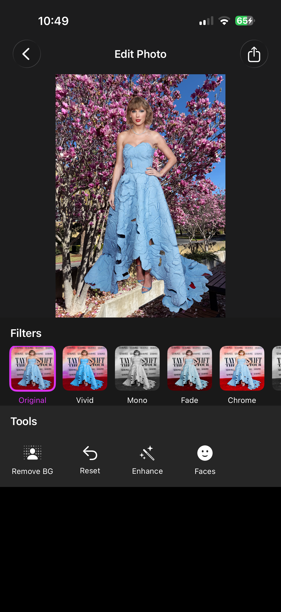</td>
</tr></table>

## Technologies

| Technology | Purpose |
|---|---|
| SwiftUI | UI framework |
| Vision | AI person segmentation, background removal |
| Core Image | Photo filters, auto enhancement, face detection |
| PhotosUI | Photo library access |

## Requirements

| Requirement | Detail |
|---|---|
| iOS | 17.4+ |
| Xcode | 16+ |

> **Simulator:** Filters and auto enhance work fully. Background removal requires a real device with Neural Engine (iPhone XS or later).
>
> **Background Removal:** Only works on photos that contain a person. Non-person photos will result in a blank image since Vision's person segmentation model only detects humans.
>
> **Face Detection:** Detects clearly visible, forward-facing faces. Small or distant faces in the background may not be detected.

## Getting Started

1. Clone the repository
```bash
git clone https://github.com/preeti-chauhan/app-01-ai-photo-editor.git
```
2. Open `AIPhotoEditor.xcodeproj` in Xcode
3. Select your target device
4. Press `Cmd + R` to build and run

## License

MIT License
